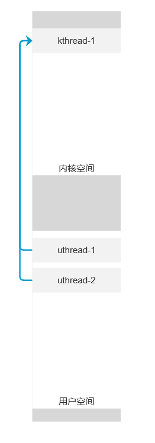
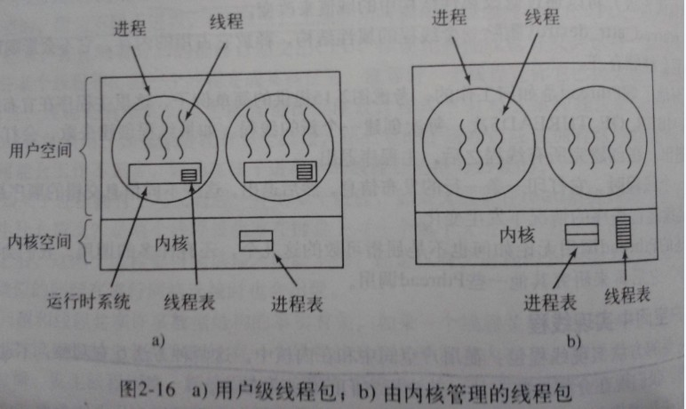
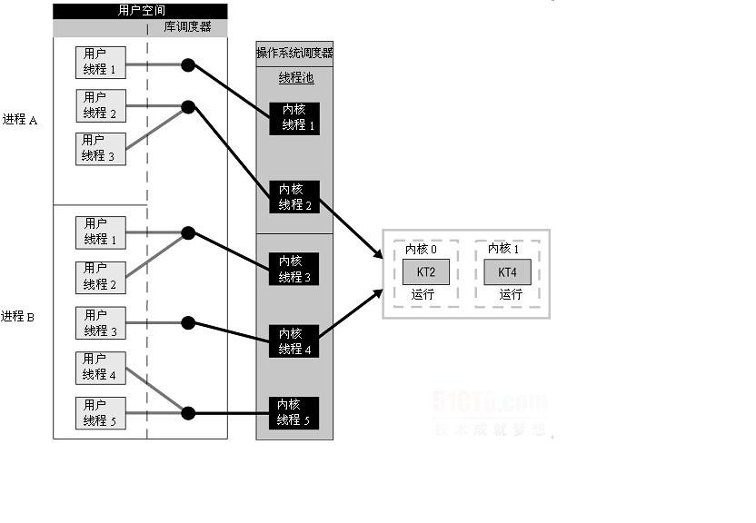

**进程是核心，内核、多线程、内存、文件系统、网络、容器和虚拟是配套的能力**

进程是程序的执行副本，操作系统用进程来分配资源。这里说的资源，就是 CPU 的计算资源、内存和磁盘的存储资源、I/O 设备的使用权等等。

操作系统通常提供 3 类用户接口：

\1. 给程序员用的API，叫系统调用

\2. 给运维人员和管理员用的shell

\3. 给大众用户的图形界面

知识点无限细分，画出关联路径，逐个击破。最后以全局的方式再关联各个知识点寻找路径

这个学习方法来自【拉钩-重学操作系统-课前必读-构建知识体系，可以这样做！】

linux中常见的文件类型：

\1. 普通文件（比如一个文本文件）

\2. 目录文件（目录是一个特殊的文件，用来存储文件清单，比如 / 也是一个文件）

\3. 可执行文件(rm 就是一个可执行文件)

\4. 管道文件

\5. socket文件（网络部分）

6.软连接文件

7.硬链接文件

标准输出流是文件

设备也是文件

ls -F 显示不同文件类型的后缀

\1. *结尾是可执行文件

\2. =结尾是socket文件

\3. @结尾的是软连接

\4. | 结尾是管道文件

\5. /结尾的是目录

指令：

grep，find

指令ps：

ps -ef    系统标准语法

ps aux  BSD风格语法

top--> htop

Pipeline

标准流：

标准输入流 0    标准输入设备

标准输出流 1    标准输出设备：显示器

标准错误流 2

重定向：

\> 覆盖重定向

\>> 追加重定向

把标准错误流重定向到标准输出流

lsx &> out.txt

lsx > out.txt 2>&1

管道：

管道（Pipeline）将一个进程的输出流定向到另一个进程的输入流，就像水管一样，作用就是把这两个文件接起来。

匿名管道：这种管道也在文件系统中，但它只是一个存储节点，不属于任何一个目录。

命名管道：这种管道是一个文件，有自己的路径

管道具有FIFO特性：先进先出

辨析管道和重定向：

待补充。。。

命令：

tee命令：中间结果

xargs命令

排序，去重，过滤

awk

集群远程操作

rsync

内核是如何工作的？

**为了帮助你理解什么是内核，请你先思考一个问题：进程和内核的关系，是不是像浏览器请求服务端服务**？

用户态程序进行系统调用，trap中断 然后内核态执行特权指定。

【上面的问题依然没有解决！！！ 】

猜测：

1. 用户线程需要通过系统调用执行特权指令时，先发出trap中断，在1-1模型中的话，内核线程处理tarp中断后执行特权指令，特权指令执行完同样trap中断，内核线程进入就绪队列，刚刚中断的用户线程继续执行

按照上面的理解，在1-1 模型，m-1模型中，linux中线程的内核态和用户态ID是否一样？？

linux中ps能区分出内核态和用户态线程吗

猜测：

进程ID是一样的，所谓线程的用户态和内核态，本质是CPU不间断执行多段代码，这段代码在内存的用户空间就是用户态，在内存的内核空间就是内核态。

区分多个线程也是内存上不同的地址段，如下线程模型是多个用户线程映射到一个内核线程。在uthread-1和uthread-2中系统调用CPU会到kthread-1中执行程序代码，系统调用API执行完回到uthread-1或uthread-2中继续执行。

在OS看来是一个线程

基于上面的猜测，再来理解一下特权模式，ring0-ring3。

线程在内核态下应用ring0-ring3的特权。线程在用户态只有ring3的特权。

内核在最里面，也就是 Ring 0。 应用在最外面也就是Ring 3。驱动在中间，也就是 Ring 1 和 Ring 2。对于相邻的两个 Ring，内层 Ring 会拥有较高的权限，可以改变外层的 Ring；

-----拉钩教育重学操作系统-请简述Linux权限划分的原则

这张图来自https://blog.csdn.net/gatieme/article/details/51892437

先看用户线程和内核线程的解释(假设是m-1模型)：

https://www.zhihu.com/question/316816087/answer/630015850

https://www.zhihu.com/question/56993503

## 理解【线程的内核态、用户态】和【用户级线程、内核级线程】

