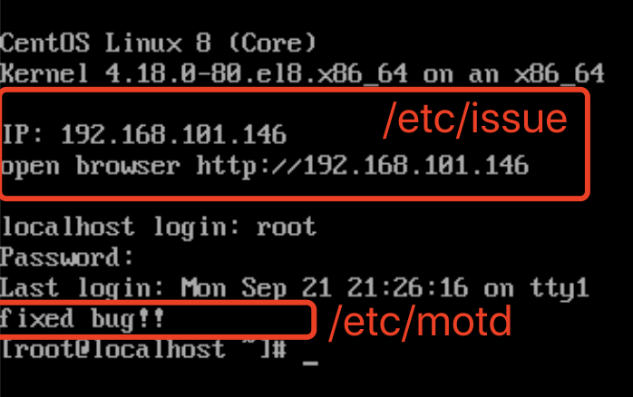

linux中的两个公告配置文件/etc/issue、/etc/motd即message of today（布告栏信息）


## 1. 登录后设置公告


```shell
[root@localhost ~]# echo "fixed bug！！！" > /etc/motd
```


## 2. 登录前设置本机IP地址

编写生成/etc/issue的脚本

```shell
[root@localhost ~]# cat /bin/issue.sh
#!/bin/sh

ipaddr=`ip addr | grep "scope global" | awk '{print $2}' |awk -F/ '{print $1}'`
cp /etc/issue.bak /etc/issue
echo IP: $ipaddr >> /etc/issue
echo open browser http://$ipaddr >> /etc/issue
echo "" >> /etc/issue
```


添加systemd配置文件，使开机后当网络可用时执行`issue.sh`

```shell
[root@localhost ~]# cat /etc/systemd/system/issue.service
[Unit]
Description=Issue INFO
After=NetworkManager-wait-online.service

[Service]
Type=oneshot
User=root
ExecStart=/bin/issue.sh

[Install]
WantedBy=multi-user.target
```


> 遇到的两个问题：
>
> 1. User必须需要写root
>
> 2. 开启selinux时，需要为issue.sh添加权限

## 最终结果：




## 参考

https://www.cnblogs.com/ginvip/p/6350281.html