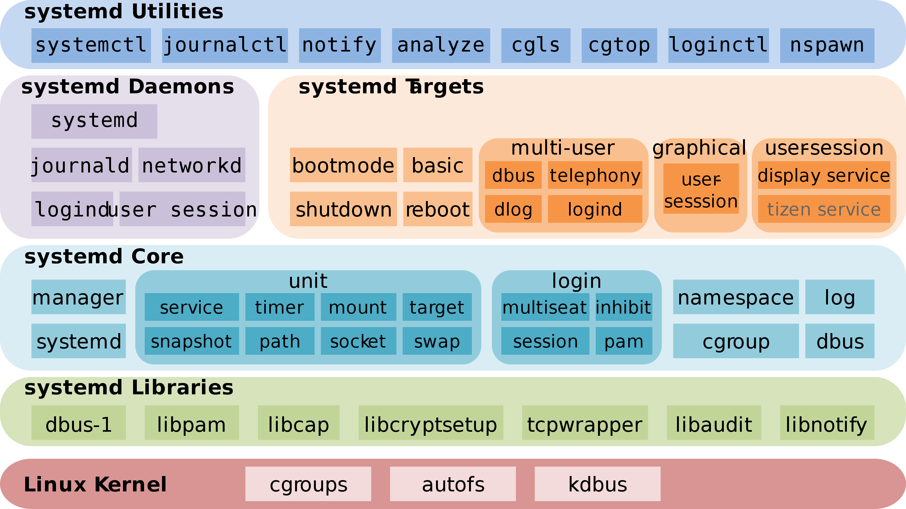
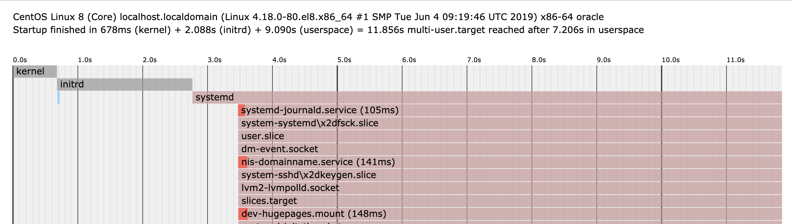
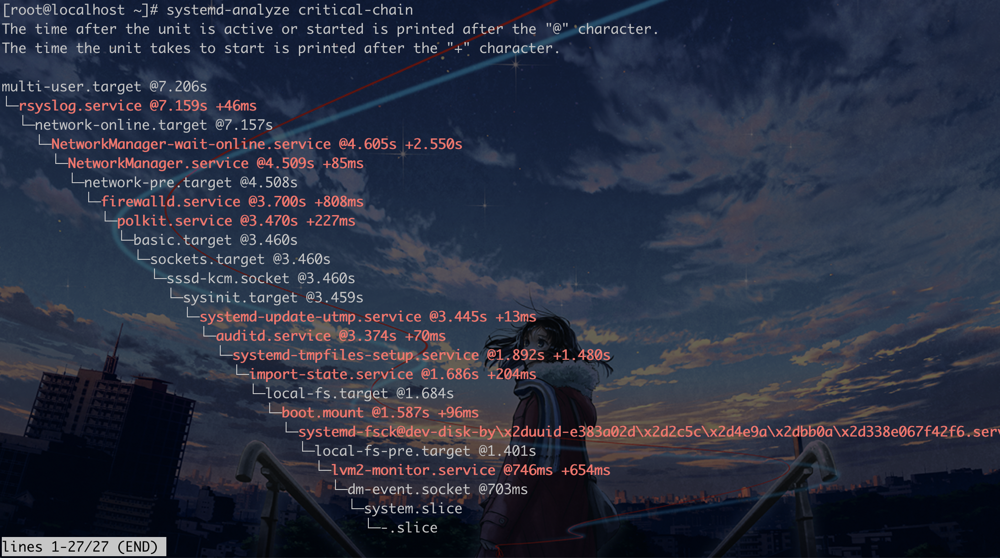

# 建立两个全局观


1. systemd体系的全局观
2. systemctl管辖下的全局观


```shell
systemctl --version
```





简介：

systemd是一个专用于 Linux 操作系统的系统与服务管理器。当作为启动进程(PID=1)运行时，它将作为初始化系统运行，也就是启动并维护各种用户空间的服务。

现在还有很多人反对使用systemd，理由就是它过于复杂，与操作系统的其他部分强耦合，违反"keep simple, keep stupid"的Unix哲学。

特点：

​    并行，按需启动守护进程

​     基于socket的激活机制： socket与服务程序分离，为每个服务预先创建激活socket，systemd监听对应socket，当需要使用时启动服务

​    基于d-bus的激活机制：

​    基于device的激活机制：

​    基于path的激活机制：


```shell
[root@localhost ~]# systemctl status systemd
Unit systemd.service could not be found.
[root@localhost ~]# ps -aux
USER       PID %CPU %MEM    VSZ   RSS TTY      STAT START   TIME COMMAND
root         1  0.0  0.7 180544 13448 ?        Ss   09:55   0:01 /usr/lib/systemd/systemd --switched-root --system --deserialize 1
root         2  0.0  0.0      0     0 ?        S    09:55   0:00 [kthreadd]

# 导出系统服务启动图
[root@localhost ~]# systemd-analyze plot > a.svg
```




```shell
# 这个图得倒着看
[root@localhost ~]# systemd-analyze critical-chain
```



systemd指的是是一个庞大的体系，


这个体系中常用的命令举例示范：

loginctl

**hostnamectl**

**localectl**

**timedatectl**

systemctl

systemd-analyze

journalctl

...


## systemctl管辖下的UNIT介绍


包含的unit种类,概念，相关的命令，依赖关系


unit的模板技术


相关命令：

远程

systemctl -H root@192.168.2.204 status nginx.service


显示某个 Unit 是否启动
`systemctl is-active application.service`
显示某个 Unit 是否启动失败
`systemctl is-failed application.service`
显示某个 Unit 服务是否开机启动
`systemctl is-enabled application.service`


重启一个服务
`systemctl restart httpd.service`
杀死一个服务的所有子进程
`systemctl kill httpd.service`
重新加载一个服务的配置文件
`systemctl reload httpd.service`
重载所有修改过的配置文件
`systemctl daemon-reload`

显示某个 Unit 的所有底层参数
`systemctl show httpd.service`
显示某个 Unit 的指定属性的值
`systemctl show -p CPUShares httpd.service`
设置某个 Unit 的指定属性
`systemctl set-property httpd.service CPUShares=500`
Unit的后缀名.service可以省略，例如启动ssh的命令systemctl start sshd.service可以写成systemctl start sshd。
Unit之间存在依赖关系，A依赖于B，就意味着systemd在启动A的时候，同时会去启动B。
**systemctl list-dependencies命令列出一个Unit的所有依赖。**
`systemctl list-dependencies nginx.service`
上面命令的输出结果之中，有些依赖是Target类型，默认不会展开显示。如果要展开Target，就需要使用--all参数。
`systemctl list-dependencies --all nginx.service`

```bash

[root@localhost system]# systemctl list-units
# 列出活动状态的service
[root@localhost system]# systemctl list-units --type service
# 列出全部service 包含非活动状态的服务
[root@localhost system]# systemctl list-units --type service
systemctl list-unit-files --type service
systemctl disable name.service
systemctl list-dependencies name.service
systemctl kill 进程名
systemctl status sshd.service 
systemctl is-active sshd
# 禁用网络，禁用后不能通过start启动也不能自动重启
systemctl mask network
# 取消禁用
systemctl unmask network
```

```
$ systemctl list-unit-files

UNIT FILE              STATE
chronyd.service        enabled
clamd@.service         static
clamd@scan.service     disabled
```

这个列表显示每个配置文件的状态，一共有四种。

- enabled：已建立启动链接
- disabled：没建立启动链接
- static：该配置文件没有[Install]部分（无法执行），只能作为其他配置文件的依赖
- masked：该配置文件被禁止建立启动链接

注意，从配置文件的状态无法看出，该 Unit 是否正在运行。这必须执行前面提到的systemctl status命令。

```
$ systemctl status bluetooth.service
```


例如：将系统默认的运行模式修改为“多用户，无图形”，可直接用ln命令把多用户模式目标文件链接到/etc/systemd/system/目录
`ln -sf /lib/systemd/system/multi-user.target /etc/systemd/system/default.target`


**（1）systemctl是systemd的主命令，用于管理系统和服务。**
重启系统
`systemctl reboot`
关闭系统，切断电源
`systemctl poweroff`
CPU停止工作
`systemctl halt`
暂停系统
`systemctl suspend`
让系统进入冬眠状态
`systemctl hibernate`
让系统进入交互式休眠状态
`systemctl hybrid-sleep`
启动进入救援状态（单用户状态）
`systemctl rescue`


**（2）systemd-analyze命令用于查看启动耗时。**
查看系统启动耗时
`systemd-analyze`
查看每个服务的启动耗时
`systemd-analyze blame`
显示瀑布状的系统启动过程流
`systemd-analyze critical-chain`
显示指定服务的启动流
`systemd-analyze critical-chain atd.service`


进程模型：

active

inactive

activating

deactivating

failed


systemctl list-units 命令可以查看当前系统的所有 **Unit** 。

```
# 列出正在运行的 Unit
$ systemctl list-units

# 列出所有Unit，包括没有找到配置文件的或者启动失败的
$ systemctl list-units --all

# 列出所有没有运行的 Unit
$ systemctl list-units --all --state=inactive

# 列出所有加载失败的 Unit
$ systemctl list-units --failed

# 列出所有正在运行的、类型为 service 的 Unit
$ systemctl list-units --type=service
```

## UNIT配置文件

Systemd 默认从目录/etc/systemd/system/读取配置文件。但是，里面存放的大部分文件都是符号链接，指向目录/usr/lib/systemd/system/，真正的配置文件存放在那个目录。systemctl enable命令用于在上面两个目录之间，建立符号链接关系。

```
$ sudo systemctl enable clamd@scan.service
# 等同于
$ sudo ln -s '/usr/lib/systemd/system/clamd@scan.service' '/etc/systemd/system/multi-user.target.wants/clamd@scan.service'
```

 /etc/systemd/system：系统管理员和用户使用

 /usr/lib/systemd/system：发行版打包者使用 


以 “#” 开头的行后面的内容会被认为是注释

相关布尔值， 1、 yes、 on、 true 都是开启， 0、 no、 off、false 都是关闭

  时间单位默认是秒，所以要用毫秒（ms）分钟（m）等须显式说明


命令

配置文件的格式，常用区块和区块中的属性参数

[Unit]：定义与Unit类型无关的通用选项；用于提供unit的描述信息、 unit行为及依赖关系等

[Service]：与特定类型相关的专用选项；此处为Service类型

[Install]：定义由“systemctl enable”以及"systemctl disable“命令在实现服务启用或禁用时用到的一些选项


**Unit]区块通常是配置文件的第一个区块，用来定义Unit的元数据，以及配置与其他Unit的关系,它的主要字段如下：**

```
Description：简单描述
Documentation：服务的启动文件和配置文件
Requires：当前Unit依赖的其他Unit，如果它们没有运行，当前Unit会启动失败
Wants：与当前Unit配合的其他Unit，如果它们没有运行，不影响当前Unit的启动
BindsTo：与Requires类似，它指定的Unit如果退出，会导致当前Unit停止运行
Before：如果该字段指定的Unit也要启动，那么必须在当前Unit之后启动
After：如果该字段指定的Unit也要启动，那么必须在当前Unit之前启动
Conflicts：这里指定的Unit不能与当前Unit同时运行
Condition...：当前Unit运行必须满足的条件，否则不会运行
Assert...：当前Unit运行必须满足的条件，否则会报启动失败
```

  **Service段的常用选项,区块配置，只有Service类型的Unit才有这个区块**

 Type：定义影响ExecStart及相关参数的功能的unit进程启动类型

simple：默认值，这个daemon主要由ExecStart接的指令串来启动，启动后常驻于内存中

forking：由ExecStart启动的程序透过spawns延伸出其他子程序来作为此daemon的主要服务。原生父程序在启动结束后就会终止

oneshot：与simple类似，不过这个程序在工作完毕后就结束了，不会常驻在内存中

dbus：与simple类似，但这个daemon必须要在取得一个D-Bus的名称后，才会继续运作.因此通常也要同时设定BusNname= 才行

notify：在启动完成后会发送一个通知消息。还需要配合NotifyAccess 来让 Systemd 接收消息

idle：与simple类似，要执行这个daemon必须要所有的工作都顺利执行完毕后才会执行。这类的daemon通常是开机到最后才执行即可的服务


  EnvironmentFile：环境配置文件

 ExecStart：指明启动unit要运行命令或脚本的绝对路径

 ExecStartPre： ExecStart前运行

 ExecStartPost： ExecStart后运行

 ExecStop：指明停止unit要运行的命令或脚本

 Restart：当设定Restart=1 时，则当次daemon服务意外终止后，会再次自动启动此服务


```
Type：定义启动时的进程行为，它有以下几种值。
Type=simple：默认值，执行ExecStart指定的命令，启动主进程
Type=forking：以fork方式从父进程创建子进程，之后父进程会退出，子进程成为主进程
Type=oneshot：一次性进程，Systemd会等当前服务退出，再继续往下执行
Type=dbus：当前服务通过D-Bus启动
Type=notify：当前服务启动完毕，会通知Systemd，再继续往下执行
Type=idle：若有其他任务，则其他任务执行完毕，当前服务才会运行
ExecStart：启动当前服务的命令
ExecStartPre：启动当前服务之前执行的命令
ExecStartPost：启动当前服务之后执行的命令
ExecReload：重启当前服务时执行的命令
ExecStop：停止当前服务时执行的命令
ExecStopPost：停止当其服务之后执行的命令
RestartSec：自动重启当前服务间隔的秒数
Restart：定义何种情况Systemd会自动重启当前服务，可能的值包括always（总是重启）、on-success、on-failure、on-abnormal、on-abort、on-watchdog
TimeoutSec：定义Systemd停止当前服务之前等待的秒数
Environment：指定环境变量
```

**[Install]通常是配置文件的最后一个区块，用来定义运行模式（Target）、Unit别名等设置，以及是否开机启动，它的主要字段如下：**


Alias：别名，可使用systemctl command Alias.service
RequiredBy：被哪些units所依赖，强依赖
WantedBy：被哪些units所依赖，弱依赖

Also：安装本服务的时候还要安装别的相关服务


```
WantedBy：它的值是一个或多个Target，当前Unit激活时（enable）时，符号链接会放入/etc/systemd/system目录下面以Target名+.wants后缀构成的子目录中
RequiredBy：它的值是一个或多个Target，当前Unit激活时，符号链接会放入/etc/systemd/system目录下面以Target名+.required后缀构成的子目录中
Alias：当前Unit可用于启动的别名
Also：当前Unit激活（enable）时，会被同时激活的其他Unit
```


注意：对于新创建的unit文件，或者修改了的unit文件，要通知systemd重载此配置文件,而后可以选择重启

  systemctl daemon-reload


```
systemctl cat sshd.service
[Unit]
Description=OpenSSH server daemon   # 当前服务的简单描述
Documentation=man:sshd(8) man:sshd_config(5)  # sshd是启动脚本，sshd_config是配置文件
After=network.target sshd-keygen.service  # 启动ssh服务之前会先启动这两个Unit
Wants=sshd-keygen.service  # 此Unit启动成功与否不影响ssh服务的正常启动

[Service]
Type=notify  # ssh服务启动成功后会通知systemd，再启动其他依赖服务
EnvironmentFile=/etc/sysconfig/sshd  # 指定ssh服务的环境参数配置文件
ExecStart=/usr/sbin/sshd -D $OPTIONS  # 启动ssh服务执行的命令
ExecReload=/bin/kill -HUP $MAINPID  # 重启ssh服务执行的命令
KillMode=process  # process表示只停止主进程，不停止子进程
Restart=on-failure  # 进程非正常退出时，包括信号终止和超时，会重启服务
RestartSec=42s  # 上面Restart重启之前需要等待42秒再重启

[Install]
WantedBy=multi-user.target   # ssh服务所在的系统运行模式
```


什么是模板


- Service unit：系统服务
- Target unit：多个 Unit 构成的一个组
- Device Unit：硬件设备
- Mount Unit：文件系统的挂载点
- Automount Unit：自动挂载点
- Path Unit：文件或路径
- Scope Unit：不是由 Systemd 启动的外部进程
- Slice Unit：进程组
- Snapshot Unit：Systemd 快照，可以切回某个快照
- Socket Unit：进程间通信的 socket
- Swap Unit：swap 文件
- Timer Unit：定时器

systemd在linux中是一个怎样的角色（initrd？服务管理，系统启动过程中的哪一个阶段）

有哪些类型的unit


## Target

和runlevel的区别

切换运行级别

systemctl isolate multi-user.target

systemctl get-default

启动流程


[bootup(7)](http://www.jinbuguo.com/systemd/bootup.html#)


 启动时，在linux16行后添加systemd.unit=desired.target
 systemd.unit=emergency.target
 systemd.unit=recure.target

 recure.target 比emergency 支持更多的功能，例如日志等


挖坑：

linux启动流程

忘记密码怎么办

Grub2


参考文章：

https://blog.51cto.com/12550795/1948348

https://www.cnblogs.com/guge-94/p/11131947.html?utm_source=wechat_session&utm_medium=social&utm_oi=983255002084667392

